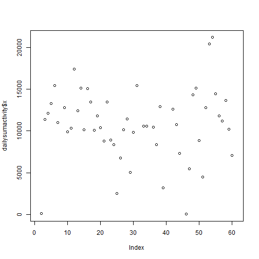
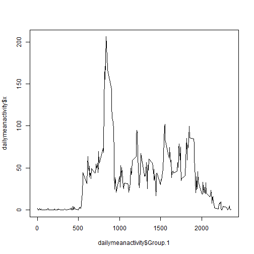

## Loading and preprocessing the data

```r
activity = read.csv("activity.csv",header=TRUE)
```


## What is mean total number of steps taken per day?

```r
dailysumactivity = aggregate(activity$steps,list(activity$date),sum)
plot(dailysumactivity$x)
```

 

```r
mean(dailysumactivity$x,na.rm=TRUE)
```

```
## [1] 10766.19
```

```r
median(dailysumactivity$x,na.rm=TRUE)
```

```
## [1] 10765
```


## What is the average daily activity pattern?

```r
dailymeanactivity=aggregate(activity$steps,list(activity$interval),mean,na.rm=TRUE)
plot(dailymeanactivity$Group.1,dailymeanactivity$x,type="l")
```

 

```r
dailymeanactivity[which.max(dailymeanactivity$x),]$Group.1
```

```
## [1] 835
```


## Imputing missing values


## Are there differences in activity patterns between weekdays and weekends?
